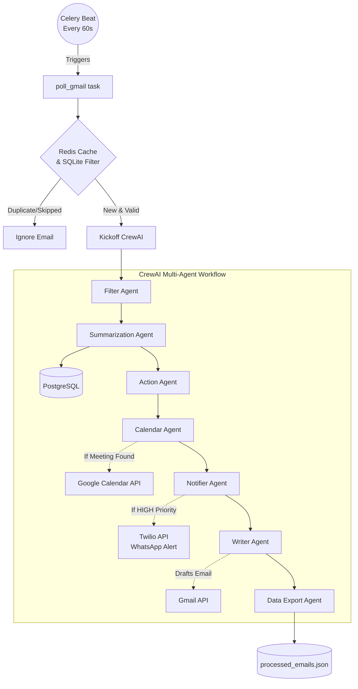

# MailMind 🧠📧

MailMind is an automated email intelligence system designed to process your Gmail inbox in the background. It categorizes emails, summarizes threads, drafts contextual responses, manages calendar events, and alerts you to high-priority messages via WhatsApp.

Built as a streamlined, headless backend service, MailMind is optimized for reliable background processing using Celery and Docker.

---

## 🚀 Architecture & Workflow

MailMind uses a multi-agent architecture to process emails asynchronously every 60 seconds.



### Features
- **Auto-Filtering**: Automatically filters out newsletters and promotional content to reduce noise.
- **Priority Detection**: Analyzes sentiment and context to classify emails as `HIGH` or `NORMAL` priority.
- **WhatsApp Notifications**: Pushes instant WhatsApp alerts via Twilio for `HIGH` priority emails.
- **Calendar Extraction**: Detects meeting times and locations, automatically creating Google Calendar events.
- **Email Summarization**: Extracts key bullet points and stores them in a PostgreSQL database and a local JSON file.
- **Auto-Drafting**: Drafts tailored responses and saves them directly to your Gmail drafts folder.
- **Background Processing**: Runs completely hands-free using **Celery** and **Redis** via Docker Compose.

---

## 🛠 Prerequisites

Ensure you have the following installed and configured before starting:
- Docker and Docker Compose
- Google Cloud Console Account (for Gmail and Calendar APIs)
- Twilio Account (for WhatsApp integration)
- OpenAI API Key
- Tavily API Key (for web search capability)

---

## 🔑 Setup Instructions

### 1. Environment Variables
Copy the example environment file:
```bash
cp .env.example .env
```
Fill in the values in `.env`:
- `OPENAI_API_KEY`: Your OpenAI API key.
- `TAVILY_API_KEY`: Your Tavily Search API key.
- `MY_EMAIL`: Your exact Gmail address (used to prevent the system from replying to your own sent emails).
- `TWILIO_*`: Your Twilio credentials and WhatsApp numbers.

### 2. Google API Authentication
For MailMind to read emails and create calendar events, you must generate a `token.json` file.
The required scopes are:
- `https://www.googleapis.com/auth/gmail.modify`
- `https://www.googleapis.com/auth/calendar`

1. Enable the **Gmail API** and **Google Calendar API** in your Google Cloud Console.
2. Download your OAuth 2.0 Client IDs as `credentials.json` and place it in the project root.
3. You must generate the `token.json` locally before starting Docker. You can do this by running a quick python script that calls the LangChain Gmail tool, which will open a browser window for Google OAuth. 
4. Once `token.json` appears in your project root, you are ready to deploy.

---

## 🐳 Running the Project

Once your `.env`, `credentials.json`, and `token.json` are in the project root, you can spin up the entire stack using Docker.

```bash
docker-compose up --build -d
```

This will start four containers:
- **db**: PostgreSQL database.
- **redis**: Redis broker for the Celery queue and duplicate-check caching.
- **celery_worker**: The background worker that actually processes the emails.
- **celery_beat**: The scheduler triggering the worker every 60 seconds.

### Viewing Logs
Because MailMind runs entirely in the background, you will want to tail the logs to see the agents working in real-time when a new email arrives:

```bash
docker-compose logs -f celery_worker
```

### Viewing Processed Data
In addition to the PostgreSQL database, the system outputs a local ledger of everything it does. You can review the processed emails, generated summaries, drafted responses, and created calendar events in:
```bash
cat processed_emails.json
```
